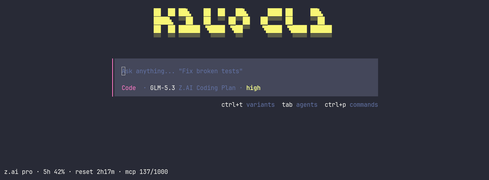
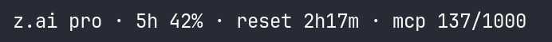
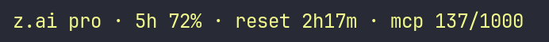
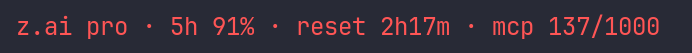
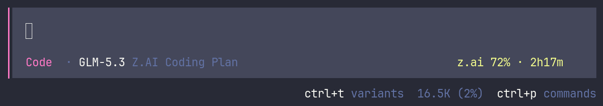

# kilo-zai-usage

A [Kilo Code CLI](https://kilo.ai) TUI plugin that shows your **z.ai GLM Coding Plan** quota directly in the status line — like the subscription limits bar in Claude Code.



## Features

- **Live quota from z.ai** — refreshed automatically every 60 seconds
  - Plan tier (`lite` / `pro` / `max`)
  - 5-hour rolling window usage, in percent
  - Time remaining until the 5-hour window resets
  - Monthly MCP tool quota (Web Search / Web Reader / Zread)
- **Two placement points**:
  - Home screen status line (footer)
  - Compact indicator next to the prompt during active sessions: `z.ai 42% · 1h33m`
- **Color thresholds** — normal below 60%, warning at 60%+, error at 85%+ of the 5-hour window
- **No extra credentials** — reuses the API key already configured in Kilo

### Color thresholds

| 5-hour usage | Status line |
| ------------ | ----------- |
| below 60%    |  |
| 60–84%       |  |
| 85% and up   |  |

### In a session

The compact indicator sits on the right side of the prompt:



## Requirements

- Kilo CLI **7.7.7 or newer** (TUI plugin support, `kilo plugin` command)
- A GLM Coding Plan subscription on [z.ai](https://z.ai) with the API key configured via `kilo auth` (provider: *Z.AI Coding Plan*)

## Installation

```bash
kilo plugin ulmen/kilo-zai-usage --global
```

Restart the Kilo TUI (`kilo`). The quota line appears in the footer of the home screen.

Notes:

- `kilo plugin` writes the registration itself — no manual config editing is needed. It records the plugin in `~/.config/kilo/tui.json`:
  ```json
  {
    "plugin": ["ulmen/kilo-zai-usage"]
  }
  ```
  On startup Kilo fetches the package from GitHub into `~/.cache/kilo/packages/`.
- Use `--global` for all projects; omit it to install into the current project's `.kilo` directory instead.
- Once installed, the plugin can be toggled, updated, or removed from inside the TUI: open the command palette (`ctrl+p`) and pick **Plugins**.

### From a local clone

Useful for hacking on the plugin:

```bash
git clone https://github.com/ulmen/kilo-zai-usage.git
kilo plugin ./kilo-zai-usage --global
```

This registers the absolute path of the clone instead of the GitHub spec; edits take effect on the next TUI restart.

### API key resolution

The key is resolved in the following order:

1. `Z_AI_API_KEY` environment variable
2. `ZHIPU_API_KEY` environment variable
3. Kilo credential store (`$XDG_DATA_HOME/kilo/auth.json`, by default `~/.local/share/kilo/auth.json`; entries `zai-coding-plan` or `zhipuai-coding-plan`) — this is what `kilo auth` writes

## Configuration (optional)

Plugin options can be passed in `tui.json`:

```json
{
  "plugin": [
    ["ulmen/kilo-zai-usage", { "pollMs": 30000 }]
  ]
}
```

| Option    | Default                 | Description                                             |
| --------- | ----------------------- | ------------------------------------------------------- |
| `pollMs`  | `60000`                 | Refresh interval in milliseconds (minimum `10000`)      |
| `baseUrl` | `https://api.z.ai`      | API host. Use `https://open.bigmodel.cn` for Zhipu (CN) plans |

## How it works

The plugin calls the z.ai usage monitor API (`GET {baseUrl}/api/monitor/usage/quota/limit`) — the same endpoint used by the official `glm-plan-usage` Claude Code plugin from zai-org. The endpoint is not part of the public documentation and may change; if it breaks, the status line shows an error message instead of quota data.

## Uninstall

Remove the plugin entry from `~/.config/kilo/tui.json` (and the cloned directory, if you installed from a local clone).

## License

[MIT](LICENSE)
